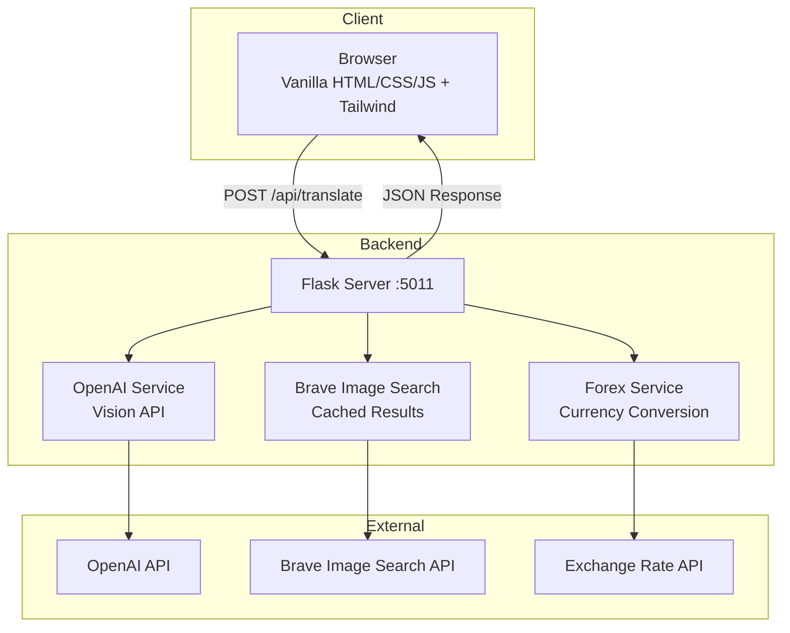

# What's On the Menu?

> **Purpose**: Translate menu photos from foreign languages to English with dish explanations, pronunciations, images, and price conversions
> **Status**: ACTIVE | Last Updated: 2026 January

## What This Solves

Translates restaurant menus from any language to English. Users upload a menu photo or take one with their camera. The app provides English translations, pronunciations, dish descriptions, representative images, and converts prices to the user's preferred currency.

## Configuration

This project uses a dual configuration system for security:

### 1. Non-Secret Config (pyproject.toml)

Version-controlled settings in `[tool.config]`:

```toml
[tool.config]
flask_port = 5011
max_upload_size_mb = 10
supported_image_formats = ["jpg", "jpeg", "png", "webp"]
```

### 2. Secrets (src/values.py - Git-Ignored)

Sensitive data like API keys:

```python
# src/values.py (create this file, it's git-ignored)
OPENAI_API_KEY = "sk-..."
BRAVE_API_KEY = "BSA..."
```

### View Config

```bash
uv run config --all        # Show all non-secret config
uv run config --flask-port # Get specific value
uv run config --help       # See all options
```

## Quick Start

```bash
# Install dependencies
uv sync

# Set up secrets
# Edit src/values.py with your actual API keys:
# - OPENAI_API_KEY
# - BRAVE_API_KEY

# Run
uv run python -m src.app
```

Server runs at [http://localhost:5011](http://localhost:5011)

## Architecture

### Mental Model

Stateless web application processing menu images through a pipeline:

1. User uploads menu image or takes photo with camera
2. Image validated (size, format)
3. OpenAI Vision API extracts and translates menu items with prices
4. Currency conversion applied if needed
5. Brave Image Search API fetches multiple images per dish
6. Results returned with translations, pronunciations, descriptions, images, and converted prices

Image search uses abstract base class pattern, allowing provider swapping (Brave, SerpAPI) without changing business logic.



### Data Flow

1. User uploads menu image or takes photo via web interface
2. Flask route validates image (size, format)
3. OpenAI Vision API processes image, returns structured JSON with translated dishes, prices, and currency
4. Forex service converts prices to target currency if needed
5. For each dish, Brave Image Search fetches multiple representative images (cached)
6. Results formatted with translations, pronunciations, descriptions, images, and converted prices
7. Uploaded image cleaned up after processing

**Key Decisions**: Abstract base class for image search enables provider swapping. Flask chosen for simplicity. No database needed for stateless design. Caching used for image search and forex rates to reduce API calls.

## Tech Stack & Why


| Technology             | Purpose              | Why This Choice                                   |
| ---------------------- | -------------------- | ------------------------------------------------- |
| Python 3.12+           | Runtime              | Modern type hints, pattern matching               |
| Flask                  | Web framework        | Lightweight, simple static file serving           |
| OpenAI API             | Vision & Translation | GPT-4 Vision provides accurate menu analysis      |
| Brave Image Search API | Dish images          | Multiple images per dish, cached results          |
| Pydantic               | Data validation      | Type-safe models for API responses                |
| Tailwind CSS           | Styling              | Utility-first, mobile-responsive, CDN-based       |
| Vanilla JS             | Frontend logic       | No build step, native-like scrolling and gestures |


## Project Structure

```
menu/
├── src/
│   ├── app.py                    # Flask app & routes
│   ├── config.py                 # Configuration management
│   ├── values.py                 # Secrets (git-ignored)
│   ├── datamodels.py             # Pydantic data models
│   ├── image_validation.py       # Image upload validation
│   ├── services/
│   │   ├── __init__.py
│   │   ├── openai_service.py     # OpenAI Vision API integration
│   │   ├── image_search.py       # Abstract base class
│   │   ├── image_search_brave.py # Brave implementation
│   │   ├── image_search_serpapi.py # SerpAPI implementation
│   │   └── forex_service.py      # Currency conversion
├── static/
│   ├── js/
│   │   └── app.js                # Frontend logic, camera support
│   └── css/
│       └── styles.css            # Custom styles, native-like scrolling
├── templates/
│   └── index.html                # Main page with Tailwind
├── tests/
│   ├── test_openai_service.py
│   ├── test_image_search.py
│   ├── test_image_validation.py
│   ├── test_upload_handler.py
│   └── test_config.py
├── pyproject.toml                # Dependencies & config
└── README.md                     # This file
```

**Organization Logic**: Services separated by concern. Image search uses abstract base class for extensibility. Forex service handles currency conversion. Frontend includes camera support and native-like gesture handling.

## Key Concepts


| Concept                                  | Description                                                                     | Why It Matters                                                              |
| ---------------------------------------- | ------------------------------------------------------------------------------- | --------------------------------------------------------------------------- |
| **Abstract Base Class for Image Search** | `ImageSearchService` defines interface, `BraveImageSearchService` implements it | Allows swapping providers (SerpAPI, others) without changing business logic |
| **Caching**                              | Image search and forex rates cached using joblib Memory                         | Reduces API calls, improves response time, lowers costs                     |
| **Pydantic Models**                      | Type-safe data validation for API responses                                     | Ensures data integrity, provides clear error messages                       |
| **Stateless Design**                     | No database, uploaded images deleted after processing                           | Keeps implementation simple, no state management needed                     |


## Data Models

```python
MenuDish
├── name: str                      # Original dish name
├── english_name: str             # English translated name
├── description: str               # 1-3 sentence explanation
├── pronunciation: str            # Phonetic pronunciation
├── image_urls: list[str] | None  # Multiple URLs from image search
├── original_text: str            # Original text from menu
├── price: str | None             # Original price string
└── converted_price: float | None # Price in target currency

MenuTranslation
├── dishes: list[MenuDish]        # List of translated dishes
├── source_language: str          # Detected source language
├── country: str                  # Detected country
├── original_currency: str | None # Currency from menu
├── exchange_rate_to_eur: float | None # Exchange rate
└── target_currency: str           # User's preferred currency
```

**Validation Rules**: Images must be <10MB, formats: jpg, jpeg, png, webp. OpenAI response must contain valid JSON with required fields.

**Transformation Logic**: OpenAI response parsed into Pydantic models. Currency conversion applied if original currency differs from target. Multiple images fetched per dish via cached Brave search.

## API Endpoints


| Endpoint         | Method | Description                        |
| ---------------- | ------ | ---------------------------------- |
| `/`              | GET    | Main page with upload interface    |
| `/api/translate` | POST   | Upload menu image, get translation |
| `/status`        | GET    | Health check                       |


### POST /api/translate

**Request**: `multipart/form-data` with `image`, optional `currency`, and `model` fields

**Example**:

```bash
curl -X POST http://localhost:5011/api/translate \
  -F "image=@menu.jpg" \
  -F "currency=USD" \
  -F "model=gpt-5-mini"
```

**Response**:

```json
{
  "status": "success",
  "data": {
    "source_language": "Spanish",
    "original_currency": "EUR",
    "exchange_rate_to_eur": 1.08,
    "target_currency": "USD",
    "dishes": [
      {
        "name": "Paella Valenciana",
        "english_name": "Valencian Paella",
        "description": "Traditional Spanish rice dish with seafood, saffron, and vegetables.",
        "pronunciation": "pah-EH-yah vah-len-see-AH-nah",
        "image_urls": ["https://example.com/paella1.jpg", "https://example.com/paella2.jpg"],
        "original_text": "Paella Valenciana",
        "price": "€18.50",
        "converted_price": 19.98
      }
    ]
  }
}
```

**Error Response**:

```json
{
  "status": "error",
  "message": "File size exceeds maximum of 10MB"
}
```

## Testing

Tests use mocking and dependency injection - **never call external APIs**.

```bash
# Run all tests
uv run pytest

# Run with coverage
uv run pytest --cov=src --cov-report=html
```

- Unit tests mock OpenAI, Brave Image Search, and Forex API responses
- Image validation tests use in-memory file objects
- Integration tests inject mocked services
- All external dependencies are mocked

## Deployment

For deployment:

1. Set up environment with Python 3.12+
2. Install dependencies: `uv sync`
3. Configure secrets in `src/values.py` (OPENAI_API_KEY, BRAVE_API_KEY)
4. Run: `uv run python -m src.app`

Server runs at [http://localhost:5011](http://localhost:5011)

For production, consider:

- Production WSGI server (gunicorn, uwsgi)
- Environment variables for secrets instead of file-based
- Rate limiting
- Monitoring and logging
- HTTPS/SSL certificates

