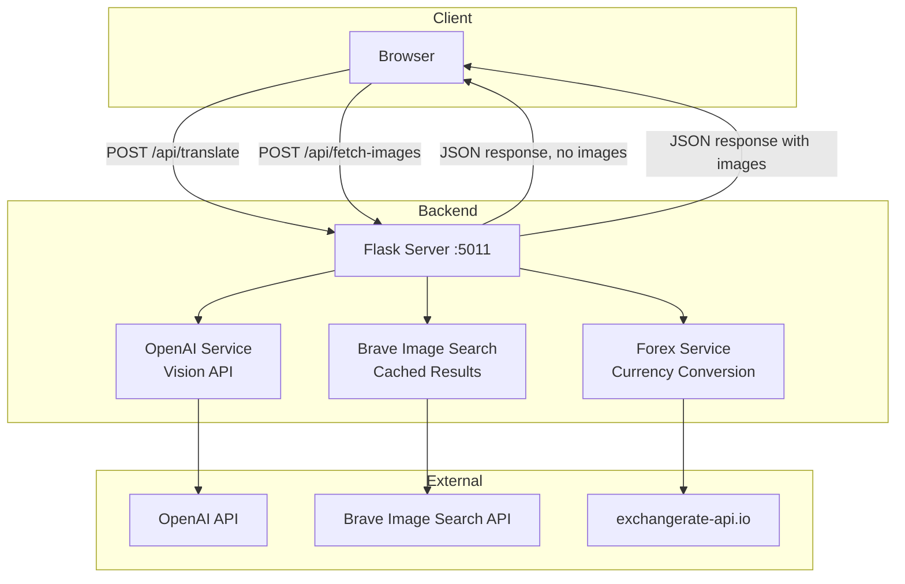

# What's On the Menu?

> **Purpose**: Translate menu photos from foreign languages to English with dish explanations, pronunciations, images, and price conversions

## What This Solves

Translates restaurant menus from any language to English. Users upload a menu photo or take one with their camera. The app provides English translations, pronunciations, dish descriptions, representative images, and converts prices to the user's preferred currency.

## Configuration

This project uses a dual configuration system for security:

### 1. Non-Secret Config (pyproject.toml)

Version-controlled settings in `[tool.config]`:

```toml
[tool.config]
flask_port = 5011
max_upload_size_mb = 10
default_target_currency = "EUR"
default_openai_model = "gpt-5-mini"
```

Supported image formats (hardcoded in `src/image_validation.py`): `jpg`, `jpeg`, `png`, `webp`

### 2. Secrets (src/values.py - Git-Ignored)

Sensitive data like API keys:

```python
# src/values.py (create this file, it's git-ignored)
OPENAI_API_KEY = "sk-..."
BRAVE_API_KEY = "BSA..."
```

### View Config

```bash
uv run config --all                    # Show all non-secret config
uv run config --flask-port             # Get specific value
uv run config --default-target-currency # Get default currency
uv run config --default-openai-model    # Get default model
uv run config --help                    # See all options
```

## Quick Start

```bash
# Install dependencies
uv sync

# Set up secrets
# Edit src/values.py with your actual API keys:
# - OPENAI_API_KEY
# - BRAVE_API_KEY

# Run
uv run python -m src.app
```

Server runs at [http://localhost:5011](http://localhost:5011)

## Architecture

### Mental Model

Stateless web application processing menu images through a two-stage pipeline:

**Stage 1: Translation**

1. User uploads menu image or takes photo with camera
2. Image validated (size, format)
3. OpenAI Vision API extracts and translates menu items with prices
4. Currency conversion applied if needed
5. Translation results returned immediately (without images)

**Stage 2: Image Fetching (Optional)**
6. If images are enabled, frontend requests images for each dish separately
7. Brave Image Search API fetches multiple images per dish (cached)
8. Images displayed as they become available

This two-stage approach allows users to see translation results quickly, while images load in the background.


```mermaid
flowchart TB
    subgraph Client
        Browser[Browser]
    end
    subgraph Backend
        Flask[Flask Server :5011]
        OpenAIService[OpenAI Service<br/>Vision API]
        ForexService[Forex Service<br/>Currency Conversion]
        ImageSearchService[Brave Image Search<br/>Cached Results]
    end
    subgraph External
        OpenAI[OpenAI API]
        BraveAPI[Brave Image Search API]
        ForexAPI[exchangerate-api.io]
    end
    
    Browser -->|POST /api/translate| Flask
    Flask --> OpenAIService
    OpenAIService --> OpenAI
    Flask --> ForexService
    ForexService --> ForexAPI
    Flask -->|JSON response, no images| Browser
    Browser -->|POST /api/fetch-images| Flask
    Flask --> ImageSearchService
    ImageSearchService --> BraveAPI
    Flask -->|JSON response with images| Browser
```

### Data Flow

**Stage 1: Translation**

1. User uploads menu image or takes photo via web interface
2. Flask route validates image (size, format)
3. OpenAI Vision API processes image, returns structured JSON with translated dishes, prices, and currency
4. Forex service converts prices to target currency if needed
5. Translation results returned to frontend (without images)
6. Uploaded image cleaned up after processing

**Stage 2: Image Fetching (if enabled)**
7. Frontend sends separate request to `/api/fetch-images` for each dish
8. Brave Image Search fetches multiple representative images per dish (cached)
9. Images displayed as they become available

## Project Structure

```
whats-on-the-menu/
├── src/
│   ├── app.py                    # Flask app & routes
│   ├── config.py                 # Configuration management
│   ├── values.py                 # Secrets (git-ignored)
│   ├── datamodels.py             # Pydantic data models
│   ├── image_validation.py       # Image upload validation
│   ├── services/
│   │   ├── __init__.py
│   │   ├── openai_service.py      # OpenAI Vision API integration
│   │   ├── image_search_brave.py # Brave Image Search implementation
│   │   └── forex_service.py      # Currency conversion
├── static/
│   ├── js/
│   │   └── app.js                # Frontend logic, camera support
│   └── css/
│       └── styles.css            # Custom styles, native-like scrolling
├── templates/
│   └── index.html                # Main page with Tailwind
├── tests/
│   ├── test_openai_service.py
│   ├── test_image_search.py
│   ├── test_image_validation.py
│   ├── test_upload_handler.py
│   └── test_config.py
├── pyproject.toml                # Dependencies & config
└── README.md                     # This file
```

## Data Models

```python
MenuDish
├── name: str                      # Original dish name
├── english_name: str             # English translated name
├── description: str               # 1-3 sentence explanation
├── pronunciation: str            # Phonetic pronunciation
├── image_urls: list[str] | None  # Multiple URLs from image search
├── original_text: str            # Original text from menu
├── price: str | None             # Original price string
└── converted_price: float | None # Price in target currency

MenuTranslation
├── dishes: list[MenuDish]        # List of translated dishes
├── source_language: str          # Detected source language
├── country: str                  # Detected country
├── original_currency: str | None # Currency from menu
├── exchange_rate_to_eur: float | None # Exchange rate
└── target_currency: str           # User's preferred currency
```

**Validation Rules**: Images must be <10MB, formats: jpg, jpeg, png, webp. OpenAI response must contain valid JSON with required fields.

**Transformation Logic**: OpenAI response parsed into Pydantic models. Currency conversion applied if original currency differs from target. Images fetched separately via `/api/fetch-images` endpoint using cached Brave search (optional, can be disabled in settings).

## API Endpoints


| Endpoint            | Method | Description                                    |
| ------------------- | ------ | ---------------------------------------------- |
| `/`                 | GET    | Main page with upload interface                |
| `/api/translate`    | POST   | Upload menu image, get translation (no images) |
| `/api/fetch-images` | POST   | Fetch images for dishes                        |
| `/status`           | GET    | Health check                                   |


### POST /api/translate

**Request**: `multipart/form-data` with `image`, optional `currency`, and `model` fields

**Example**:

```bash
curl -X POST http://localhost:5011/api/translate \
  -F "image=@menu.jpg" \
  -F "currency=USD" \
  -F "model=gpt-5-mini"
```

**Response** (note: `image_urls` is always `null` in this endpoint):

```json
{
  "status": "success",
  "data": {
    "source_language": "Spanish",
    "original_currency": "EUR",
    "exchange_rate_to_eur": 1.08,
    "target_currency": "USD",
    "dishes": [
      {
        "name": "Paella Valenciana",
        "english_name": "Valencian Paella",
        "description": "Traditional Spanish rice dish with seafood, saffron, and vegetables.",
        "pronunciation": "pah-EH-yah vah-len-see-AH-nah",
        "image_urls": null,
        "original_text": "Paella Valenciana",
        "price": "€18.50",
        "converted_price": 19.98
      }
    ]
  }
}
```

### POST /api/fetch-images

**Request**: JSON body with `dishes` array, `language`, and optional `include_images` boolean

**Example**:

```bash
curl -X POST http://localhost:5011/api/fetch-images \
  -H "Content-Type: application/json" \
  -d '{
    "dishes": [{"name": "Paella Valenciana"}],
    "language": "Spanish",
    "include_images": true
  }'
```

**Response**:

```json
{
  "status": "success",
  "images": {
    "Paella Valenciana": [
      "https://example.com/paella1.jpg",
      "https://example.com/paella2.jpg"
    ]
  }
}
```

**Error Response**:

```json
{
  "status": "error",
  "message": "File size exceeds maximum of 10MB"
}
```

## Testing

Tests use mocking and dependency injection - **never call external APIs**.

```bash
# Run all tests
uv run pytest

# Run with coverage
uv run pytest --cov=src --cov-report=html
```

- Unit tests mock OpenAI, Brave Image Search, and Forex API responses
- Image validation tests use in-memory file objects
- Integration tests inject mocked services
- All external dependencies are mocked

## Deployment

For deployment:

1. Set up environment with Python 3.12+
2. Install dependencies: `uv sync`
3. Configure secrets in `src/values.py` (OPENAI_API_KEY, BRAVE_API_KEY)
4. Run: `uv run python -m src.app`

Server runs at [http://localhost:5011](http://localhost:5011)

For production, consider:

- Production WSGI server (gunicorn, uwsgi)
- Environment variables for secrets instead of file-based
- Rate limiting
- Monitoring and logging
- HTTPS/SSL certificates
- Image CDN for serving cached images
- Request timeout handling for long-running image fetches

